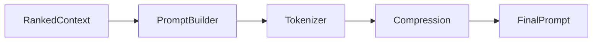

# RFC 0012: Prompt Builder Architecture

## Purpose

This RFC defines the architecture for the Prompt Builder module within the Context Engine.

## Goals

- Define a standard pipeline for assembling retrieved and ranked context into LLM prompts.
- Establish context compression strategies to fit token limits.
- Integrate with the Intelligence Layer for semantic relevance.

## Architecture

The Prompt Builder acts as the final stage before data is passed to the LLM. It takes the output of the Ranking Engine and applies templates, token counting, and compression.

### Stages

1. **Template Selection**: Load the appropriate prompt template (e.g., Code Assistant, Generic Chat).
2. **Context Injection**: Map the ranked `ContextObject` entities to template variables.
3. **Token Counting**: Use the specific LLM tokenizer (via Provider SDK) to measure the assembled payload.
4. **Compression**: If the token limit is exceeded, apply compression strategies:
   - Truncate oldest episodic memory.
   - Summarize dense text.
   - Remove low-ranked context objects.

## Diagrams

## Tradeoffs

Building tokenizers directly into the runtime couples us slightly to LLM specifics, but doing this locally avoids extra network calls and latency.

## Future Work

Future sprints will add advanced semantic compression using small local models.
