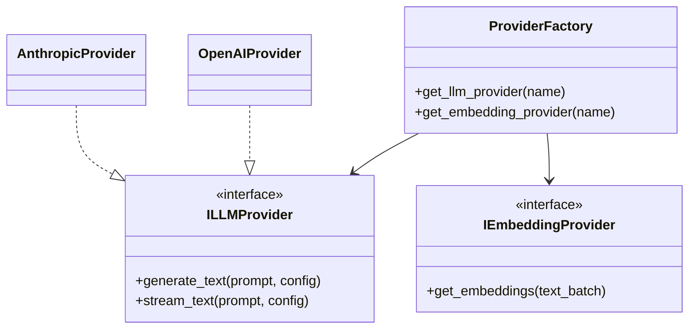

# RFC 0013: Provider SDK Architecture

## Purpose

This RFC defines the architecture for the Provider SDK in OpenContextPlatform (Phase 3).

## Goals

- Create an abstraction layer protecting the Core Context Engine from external provider dependencies.
- Define standard interfaces for LLMs, Embedding Models, Object Storage, and Caching.
- Allow community contributors to build custom providers without touching core runtime code.

## Architecture

The Provider SDK uses the Adapter Pattern. The Core Runtime calls abstract interfaces (e.g., `ILLMProvider`), and specific Provider packages (e.g., `openai-provider`, `anthropic-provider`) implement these interfaces.

## Diagrams

## Examples

If a user wants to use local Ollama models, they configure `provider_config.json` with `llm: ollama`. The `ProviderFactory` loads the `OllamaProvider` which implements `ILLMProvider`.

## Tradeoffs

An abstraction layer prevents us from using highly specific, proprietary features of certain LLMs unless we expose an `escape_hatch` mechanism in the `config` payload.

## Future Work

Sprint 007 will implement these interfaces in Python, starting with OpenAI and Local/Ollama providers as the reference implementations.
