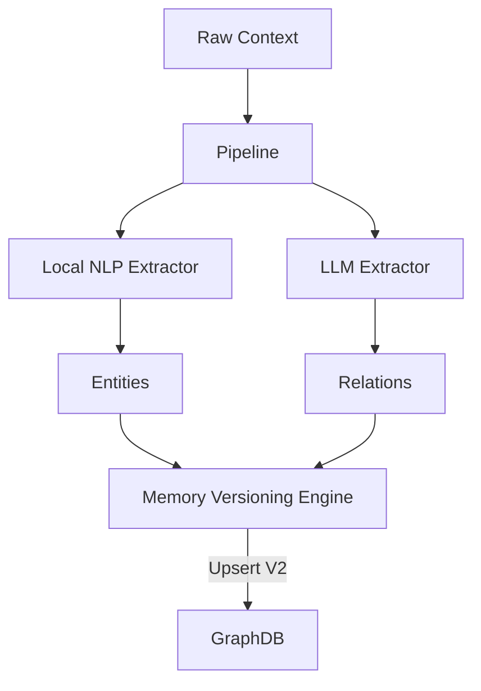

# RFC 0015: Intelligence Layer Architecture

## Purpose
This RFC defines the architecture for the OpenContextPlatform Intelligence Layer (Phase 5).

## Goals
- Design an asynchronous data processing pipeline for incoming ContextObjects.
- Support **Dual-Mode Extraction**: Utilize both local NLP models (e.g., spaCy) for fast, cheap entity extraction, and LLMs (via the Provider SDK) for complex relation extraction.
- Support **Episodic Memory via Context Versioning**: Instead of an append-only event log, update existing Context Objects but maintain strict version history to track episodic changes over time.

## Architecture

1. **Pipeline Manager**: Orchestrates the flow of a new `ContextObject` through extraction and memory processing.
2. **Dual-Mode Extractors**:
   - `LocalNLPExtractor`: Uses regex/spaCy to quickly pull out simple entities (Dates, Names).
   - `LLMExtractor`: Uses the `ILLMProvider` to extract complex ontologies (`SIMILAR_TO`, `DEPENDS_ON`).
3. **Context Versioning**: When an episodic event updates an entity (e.g., Jira ticket status changes), the Intelligence Layer creates a new version of the ContextObject, retaining the `previous_version_id` to build a temporal graph.

## Diagrams

## Tradeoffs
Using Context Versioning allows us to easily query "current state" while still supporting time-travel queries ("what did this look like yesterday"). The tradeoff is increased storage consumption in the GraphDB.
