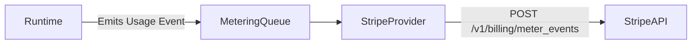

# RFC 0018: Billing and Metering

## Purpose
This RFC defines how the OpenContextPlatform Cloud service tracks usage and charges customers.

## Goals
- Meter usage across key dimensions: Ingestion Volume (Context Nodes), LLM Token Usage, and Search Queries.
- Integrate with an explicit `IBillingProvider` (with Stripe as the primary implementation).

## Architecture
1. **IBillingProvider**: Abstract interface defining methods like `create_customer`, `subscribe`, and `report_usage`.
2. **Usage Events**: The Core Runtime emits asynchronous usage events whenever a ContextObject is ingested or the PromptBuilder calls the LLM.
3. **Stripe Integration**: The Stripe provider receives these usage events, aggregates them locally via the Cache Provider, and pushes them to the Stripe Metered Billing API on a scheduled interval.

## Diagrams

