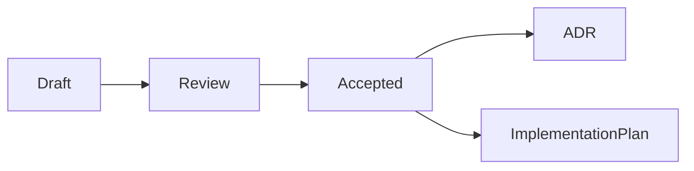

# RFCs

## Purpose

RFCs propose significant changes to OpenContextPlatform before implementation.

## Goals

- Capture motivation, alternatives, and impact.
- Give contributors a structured path for architecture review.
- Prevent accidental API and specification drift.

## Architecture

RFCs feed ADRs. Accepted RFCs may update specs, docs, book chapters, tests, and implementation plans.

## Diagrams

## Examples

Runtime architecture, plugin isolation, provider contracts, connector synchronization, and deployment topology require RFCs.

## Tradeoffs

RFCs add process, but they make large decisions visible and reversible before code hardens around them.

## Future Work

RFC templates and status automation will be added after repository workflows are introduced.
