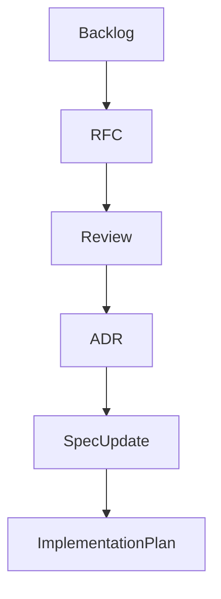

# RFC Backlog

## Purpose

This backlog defines the RFC candidates required to move OpenContextPlatform from foundation documentation toward implementation readiness.

## Goals

- Prioritize architecture decisions before runtime code.
- Link RFC work to specifications, ADRs, and sprint planning.
- Make dependencies explicit so agents do not implement out of order.

## Architecture

RFCs are the proposal layer between roadmap intent and architecture decisions. Accepted RFCs produce ADRs, specification updates, diagrams, API design, database design, sequence diagrams, test plans, and eventually implementation tasks.

## Diagrams

## Examples

Runtime architecture must be accepted before runtime package layout exists. Plugin lifecycle must be accepted before provider or connector plugins are implemented.

### Prioritized RFC Candidates

| Priority | RFC Candidate | Rationale | Owner Role | Depends On | Proposed Sprint |
| --- | --- | --- | --- | --- | --- |
| P0 | RFC-002 Context Object Contract | Every subsystem depends on stable context identity, provenance, policy, relationships, and lifecycle semantics | Architect | Sprint 001 maturity matrix | Sprint 001 |
| P0 | RFC-003 Specification Stability and Versioning | The project needs compatibility levels before specs become implementation inputs | Architect | RFC-002 | Sprint 001 |
| P0 | RFC-004 Runtime Architecture | Defines domain, application, ports, adapters, events, and control plane boundaries | Architect | RFC-002, RFC-003 | Sprint 002 |
| P0 | RFC-005 Plugin Lifecycle and Isolation | Providers and connectors require manifest, loading, lifecycle, health, isolation, and compatibility rules | Security | RFC-003, RFC-004 | Sprint 002 |
| P1 | RFC-006 Provider SDK Architecture | Establishes provider ports for LLM, embedding, graph, vector, storage, cache, authn, and authz | Architect | RFC-004, RFC-005 | Sprint 003 |
| P1 | RFC-007 Connector SDK Architecture | Defines sync, permissions, checkpoints, source metadata, deletion propagation, and connector testing | Architect | RFC-002, RFC-005 | Sprint 003 |
| P1 | RFC-008 API Versioning and Schema Strategy | Defines OpenAPI, JSON Schema, protobuf posture, error taxonomy, pagination, and idempotency | Developer | RFC-002, RFC-003, RFC-004 | Sprint 002 |
| P1 | RFC-009 Conformance Test Strategy | Defines how specs become testable across providers, connectors, SDKs, and runtime behavior | Tester | RFC-003 | Sprint 001 |
| P1 | RFC-010 Security Model | Defines authentication, authorization, plugin trust, connector permissions, prompt safety, tenancy, and audit | Security | RFC-002, RFC-005 | Sprint 002 |
| P2 | RFC-011 Deployment Topology | Defines Docker, Compose, Helm, Kubernetes, Terraform, AWS, Azure, and GCP deployment boundaries | Architect | RFC-004, RFC-010 | Sprint 004 |
| P2 | RFC-012 Observability and Operations | Defines logs, metrics, traces, health checks, SLOs, and operational events | Developer | RFC-004, RFC-011 | Sprint 004 |
| P2 | RFC-013 Prompt Package Contract | Defines prompt package schema, token accounting, citations, redaction, and provider rendering | Architect | RFC-002, RFC-008, RFC-010 | Sprint 003 |

### Sprint 001 RFC Targets

Sprint 001 should draft RFC-002, RFC-003, and RFC-009 only. Other RFCs remain queued until those foundations are reviewable.

## Tradeoffs

The backlog prioritizes context, stability, runtime, and plugin architecture ahead of SDK and deployment work. This delays ecosystem deliverables, but avoids building SDKs around unstable contracts.

## Future Work

Future backlog updates should add status, reviewers, links to RFC files, and acceptance decisions after the first RFC drafts are created.
