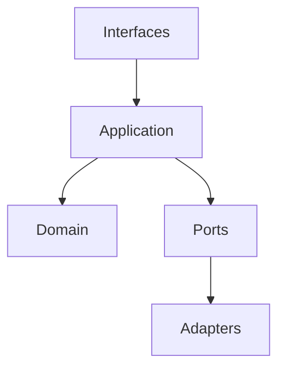

# Runtime

## Purpose

This directory will contain the Context Runtime after the runtime RFC and architecture design are accepted.

## Goals

- Coordinate retrieval, memory, ranking, prompt building, events, and plugins.
- Keep domain logic independent from infrastructure.
- Provide stable API-first behavior.

## Architecture

Runtime code will be organized around domain, application services, ports, adapters, and interfaces.

## Diagrams

## Examples

Future runtime services include retrieval orchestration, plugin manager, memory service, ranking pipeline, and prompt builder.

## Tradeoffs

No runtime business logic exists in the bootstrap. This protects the project from implementing before the contracts are stable.

## Future Work

Create runtime RFCs, API designs, sequence diagrams, and tests before adding code here.
