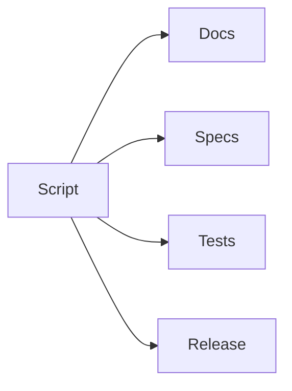

# Scripts

## Purpose

This directory will contain repository automation scripts.

## Goals

- Automate repeatable maintenance tasks.
- Avoid hiding product behavior in scripts.
- Keep scripts documented, reviewed, and safe.

## Architecture

Scripts may support documentation validation, schema generation, release preparation, conformance orchestration, and local development.

## Diagrams

## Examples

Future scripts may generate spec indexes, validate Mermaid blocks, run conformance suites, or prepare release notes.

## Tradeoffs

Scripts can become untyped infrastructure. Critical automation should eventually move into tested packages or CI workflows.

## Future Work

Scripts will be added only with clear ownership and documentation.
