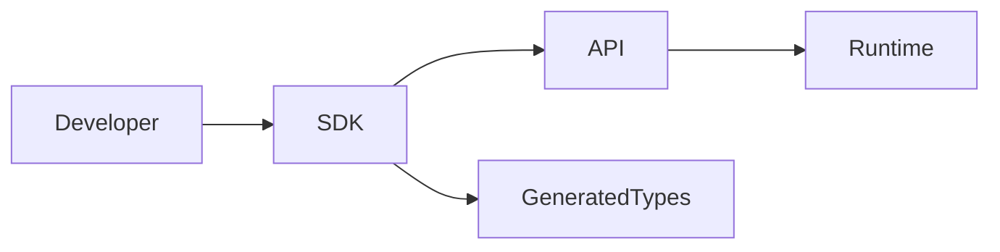

# SDKs

## Purpose

This directory will contain official SDKs for OpenContextPlatform.

## Goals

- Support Python, TypeScript, Go, Java, Rust, and .NET.
- Keep SDKs API-first and specification-aligned.
- Provide developer ergonomics without hiding platform semantics.

## Architecture

SDKs wrap public APIs, generated schemas, authentication flows, provider interfaces, connector interfaces, and conformance utilities.

## Diagrams

## Examples

A TypeScript SDK can build context queries while a Go SDK supports provider plugin authors.

## Tradeoffs

Maintaining many SDKs is expensive. The project will rely on generated contracts and shared conformance tests where practical.

## Future Work

SDK language priorities, generators, and release policy will be decided by RFC and ADR.
