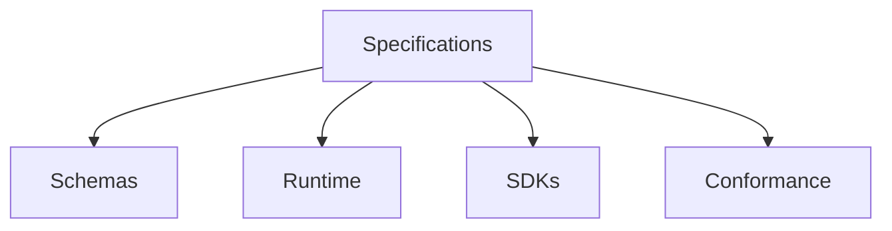

# Specifications

## Purpose

This directory contains the official OpenContextPlatform specifications.

## Goals

- Define normative contracts before implementation.
- Keep context, memory, providers, connectors, plugins, ranking, retrieval, and prompt building portable.
- Provide the foundation for schemas, SDK generation, and conformance tests.

## Architecture

Specifications are stable contracts that inform docs, book chapters, RFCs, ADRs, runtime code, SDKs, providers, connectors, and tests.

## Diagrams

## Examples

The Context Specification defines context object semantics. The Retrieval Specification defines query planning semantics. The Prompt Builder Specification defines prompt package assembly.

## Tradeoffs

Specification-first development delays implementation but prevents unstable APIs from becoming ecosystem commitments.

## Future Work

Future work includes JSON Schema, OpenAPI, protobuf definitions, compatibility levels, and generated conformance suites.
