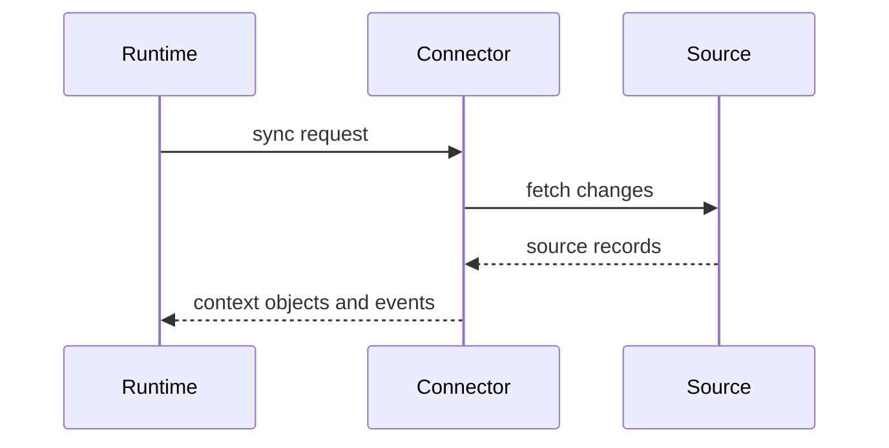

# Connector Specification

## Purpose

The Connector Specification defines how external systems supply context to OpenContextPlatform.

## Goals

- Support GitHub, GitLab, Bitbucket, Jira, Slack, Notion, Confluence, Filesystem, SQL, REST, and MCP connectors.
- Normalize ingestion, synchronization, deletion, permission mapping, and change events.
- Make connectors testable through shared conformance suites.

## Architecture

Connectors are plugins that produce context objects and events. They must declare source capabilities, authentication requirements, supported sync modes, rate limits, and permission semantics.

## Diagrams

## Examples

A GitHub connector emits repository files, pull requests, issues, review comments, and permission metadata. A SQL connector emits schema, rows, lineage, and query-safe metadata based on configured policies.

## Tradeoffs

Connectors must avoid over-normalizing source systems. The contract preserves source-specific metadata while requiring enough common structure for ranking and retrieval.

## Future Work

Future versions will define incremental sync checkpoints, webhook handling, deletion propagation, connector sandboxing, and permission test fixtures.
