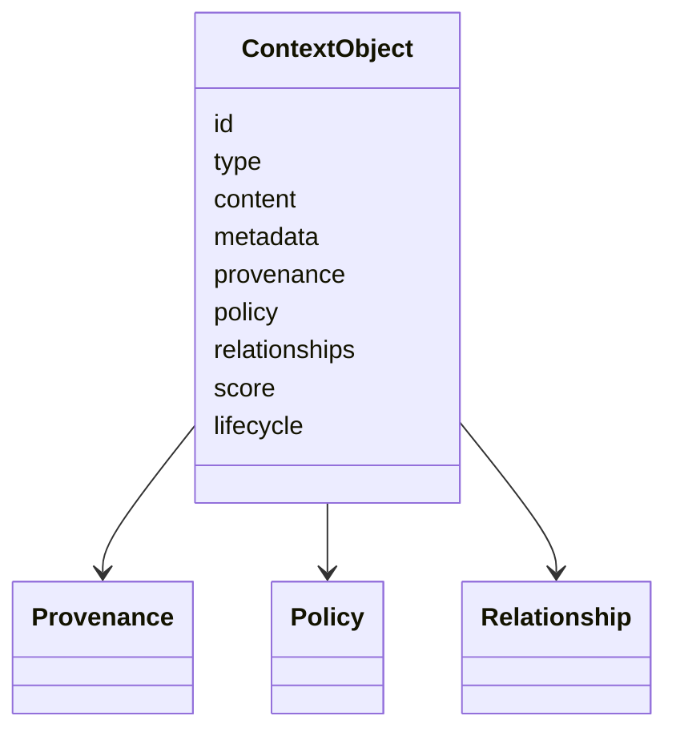

# Context Specification

## Purpose

The Context Specification defines the canonical unit of contextual knowledge exchanged across OpenContextPlatform APIs, providers, connectors, memory systems, retrievers, rankers, and prompt builders.

## Goals

- Provide a portable context object independent of model or storage vendor.
- Preserve provenance, permissions, freshness, and confidence.
- Support text, structured data, code, files, events, embeddings, graph references, and multimodal metadata.
- Enable deterministic ranking, filtering, summarization, and prompt assembly.

## Architecture

A context object is a domain entity with stable identity, content, metadata, provenance, policy, relationships, and lifecycle state. Runtime adapters may store it differently, but public APIs must preserve the semantic contract.

## Diagrams

## Examples

A GitHub issue comment, Jira ticket, Slack thread, source file chunk, SQL row, memory summary, and graph node can all be represented as context objects when their source, permissions, and lifecycle are explicit.

## Tradeoffs

The model includes more metadata than a simple document chunk. That increases ingestion complexity but is required for enterprise-safe retrieval and prompt construction.

## Future Work

Future versions will define JSON Schema, protobuf mappings, canonical hashing, multimodal payload rules, and conformance tests.
