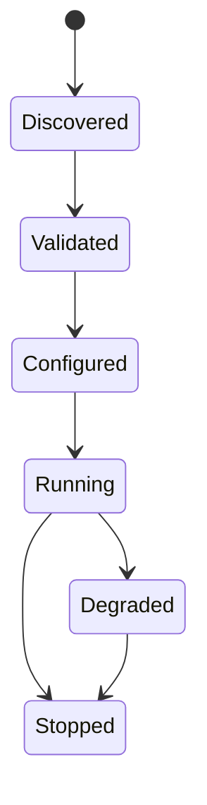

# Plugin Specification

## Purpose

The Plugin Specification defines packaging, discovery, lifecycle, isolation, configuration, and compatibility rules for OpenContextPlatform plugins.

## Goals

- Allow providers and connectors to evolve independently from the runtime.
- Define stable plugin metadata and version compatibility.
- Support enterprise controls such as signing, allowlists, and sandbox policies.

## Architecture

Plugins register capabilities with the runtime through manifests and lifecycle hooks. The runtime owns loading, configuration, health checks, events, and shutdown.

## Diagrams

## Examples

A vector database plugin declares search operations, filter dialect support, index lifecycle, version range, configuration schema, and health checks.

## Tradeoffs

Plugin isolation increases operational complexity. It is necessary to support third-party ecosystems and enterprise trust boundaries.

## Future Work

Future versions will define manifest schema, signature verification, WASM or process isolation options, marketplace metadata, and compatibility testing.
