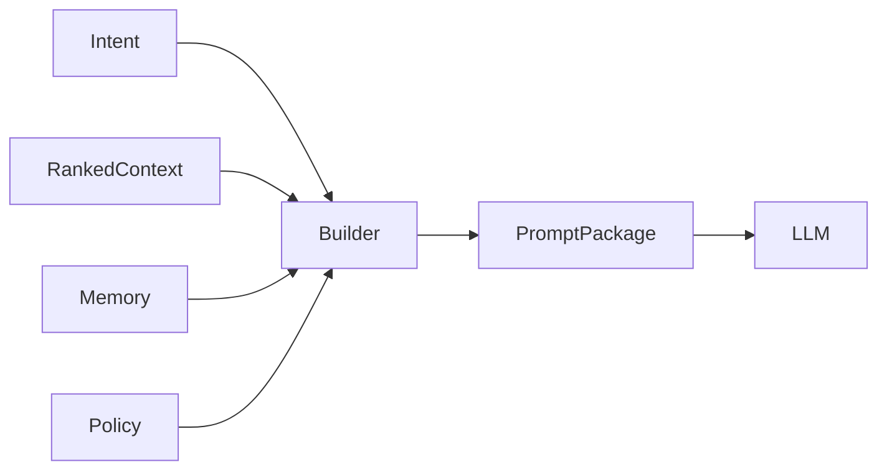

# Prompt Builder Specification

## Purpose

The Prompt Builder Specification defines how ranked context, memory, instructions, policies, and task intent are assembled into model-ready prompts.

## Goals

- Keep prompt assembly deterministic and auditable.
- Preserve provenance and permission boundaries.
- Support multiple LLM providers and context window constraints.
- Separate policy-controlled system instructions from user and retrieved content.

## Architecture

Prompt building is a final composition stage. It receives ranked context and emits a structured prompt package with sections, citations, token budgets, redaction records, and provider-specific rendering hints.

## Diagrams

## Examples

For code assistance, the prompt package may include repository summary, active file context, related symbols, dependency notes, and constraints. For enterprise support, it may include customer policy, knowledge articles, ticket history, and escalation rules.

## Tradeoffs

Portable prompt packages cannot fully optimize for every model. Provider-specific renderers may improve results while preserving a common core contract.

## Future Work

Future versions will define token accounting, prompt templates, citation formats, redaction schemas, and prompt evaluation fixtures.
