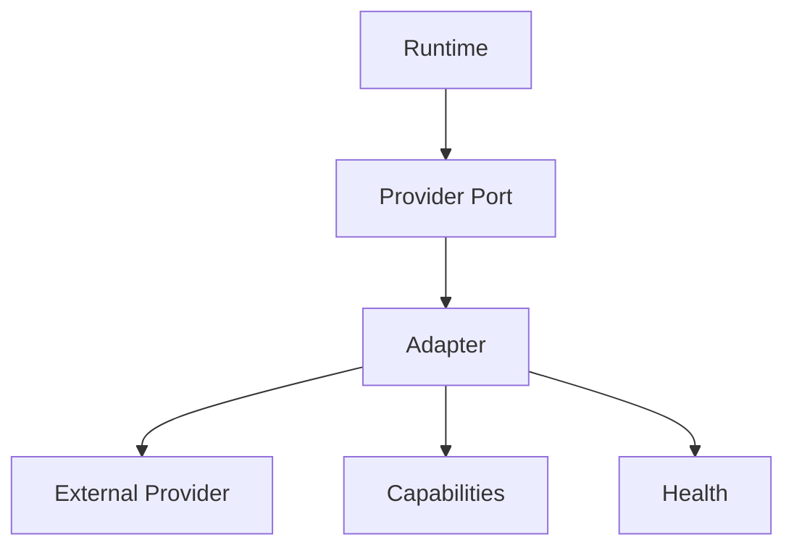

# Provider Specification

## Purpose

The Provider Specification defines contracts for pluggable LLM, embedding, graph, vector, storage, cache, authentication, authorization, and connector providers.

## Goals

- Keep runtime logic independent of vendor APIs.
- Make provider capabilities discoverable.
- Support conformance testing across implementations.
- Allow operators to swap providers without changing application code.

## Architecture

Providers implement ports defined by the runtime. Adapters translate between provider-native APIs and OpenContextPlatform contracts.

## Diagrams

## Examples

An embedding provider exposes model metadata, dimension count, batching limits, rate limits, and embedding operations. A vector provider exposes indexing, search, filtering, and deletion semantics.

## Tradeoffs

The provider contract cannot expose every vendor-specific feature directly. Extensions are allowed, but portable capabilities must remain explicit.

## Future Work

Future versions will define capability negotiation, error taxonomy, retry semantics, streaming behavior, and provider certification.
