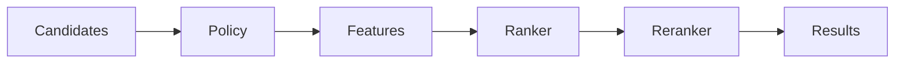

# Ranking Specification

## Purpose

The Ranking Specification defines how candidate context is scored, ordered, explained, and filtered before prompt construction or API return.

## Goals

- Combine semantic similarity, lexical signals, graph proximity, freshness, authority, permissions, and user intent.
- Make ranking explainable and testable.
- Support pluggable ranking providers.

## Architecture

Ranking is a pipeline that receives retrieval candidates, applies policy filters, computes features, combines scores, and emits ordered context with explanations.

## Diagrams

## Examples

For coding context, a recently edited file imported by the active file may outrank a semantically similar but unrelated document. For enterprise search, permission and source authority may dominate freshness.

## Tradeoffs

Ranking quality often benefits from provider-specific models. The specification keeps the portable explanation and scoring contract separate from provider internals.

## Future Work

Future versions will define score normalization, evaluation datasets, A/B testing hooks, feedback learning, and fairness constraints.
