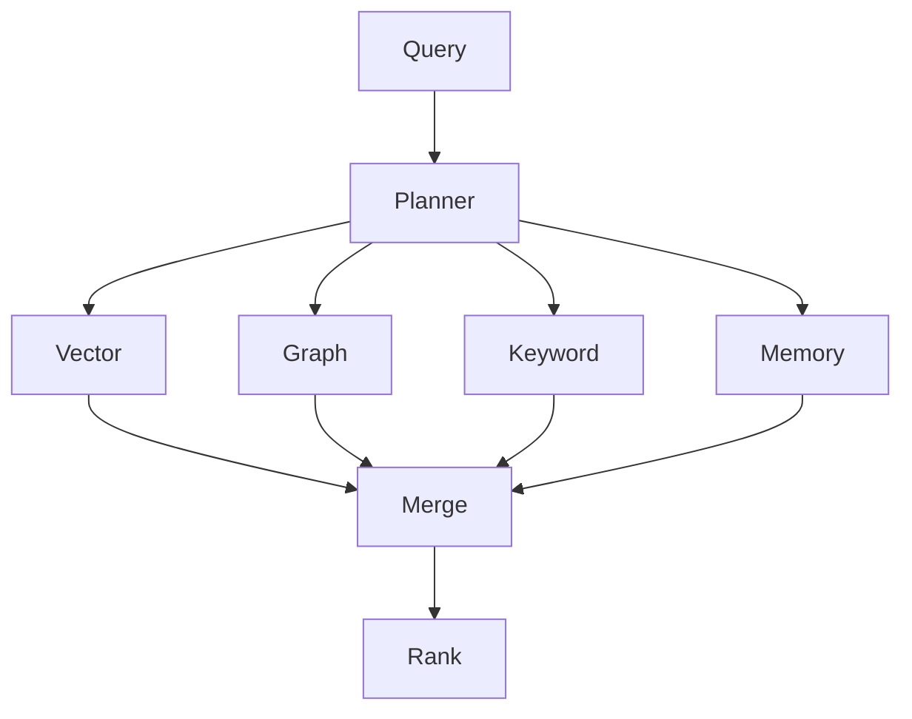

# Retrieval Specification

## Purpose

The Retrieval Specification defines how OpenContextPlatform discovers candidate context from memory, vector, graph, keyword, metadata, and connector-backed sources.

## Goals

- Support hybrid retrieval across multiple stores.
- Preserve authorization and tenant isolation.
- Return candidates with provenance and retrieval explanations.
- Allow query planning and provider-specific optimization.

## Architecture

Retrieval is modeled as a query plan executed across pluggable sources. The runtime coordinates fan-out, filtering, result merging, and handoff to ranking.

## Diagrams

## Examples

A coding agent query may retrieve active file neighbors from graph storage, similar code chunks from vector search, README sections from keyword search, and prior repository summaries from memory.

## Tradeoffs

Hybrid retrieval has higher latency and operational complexity than single-store search, but it gives better recall and portability across domains.

## Future Work

Future versions will define query DSL, pagination, streaming retrieval, caching, cost budgets, and benchmark suites.
