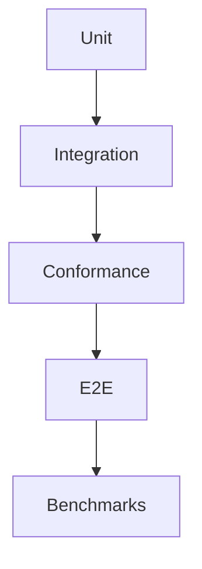

# Tests

## Purpose

This directory will contain the cross-project testing strategy and shared fixtures.

## Goals

- Target coverage above 95 percent for implemented runtime logic.
- Support pytest, Playwright, Locust, benchmarks, integration tests, and conformance tests.
- Treat specifications as testable contracts.

## Architecture

Tests will be organized by unit, integration, conformance, end-to-end, performance, security, and compatibility layers.

## Diagrams

## Examples

Provider conformance tests verify capability reporting and error behavior. Connector tests verify permission mapping and deletion propagation.

## Tradeoffs

High coverage requires investment. For infrastructure contracts, test gaps become ecosystem risk.

## Future Work

Test suites will be created alongside approved runtime, provider, connector, and SDK designs.
