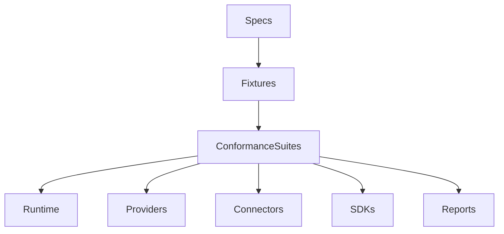

# Conformance Test Strategy

## Purpose

This document defines the conformance testing strategy for OpenContextPlatform specifications before executable tests are added.

## Goals

- Turn specifications into testable contracts.
- Define conformance categories for providers, connectors, context, memory, retrieval, ranking, and prompt builder behavior.
- Identify future pytest, Playwright, Locust, benchmark, and coverage integration points.
- Preserve the Sprint 001 rule that no executable tests are implemented yet.

## Architecture

Conformance testing will sit between specifications and implementation. Each conformance suite will validate that a runtime, provider, connector, SDK, or deployment honors the relevant public contract without relying on private implementation details.

## Diagrams

## Examples

A vector provider conformance suite should verify capability reporting, index lifecycle, filtering behavior, error handling, and health checks. A connector conformance suite should verify source permission mapping, checkpoint behavior, deletion propagation, and context object output.

### Conformance Categories

| Category | Contract Under Test | Future Test Focus | Primary Tooling |
| --- | --- | --- | --- |
| Context Object | `specs/context-spec.md` | identity, provenance, metadata, policy, relationships, lifecycle, serialization | pytest, schema validation |
| Memory | `specs/memory-spec.md` | scopes, provenance, confidence, decay, invalidation, retention, conflict behavior | pytest, benchmarks |
| Provider | `specs/provider-spec.md` | capabilities, health, error taxonomy, retries, rate limits, streaming, provider-specific extensions | pytest, provider fixtures |
| Connector | `specs/connector-spec.md` | sync modes, checkpoints, source permissions, deletion propagation, rate limits, source metadata | pytest, mocked source systems |
| Plugin | `specs/plugin-spec.md` | manifest validation, lifecycle hooks, compatibility, isolation, signing, health states | pytest, security fixtures |
| Retrieval | `specs/retrieval-spec.md` | query planning, hybrid fan-out, authorization filtering, pagination, streaming, cache behavior | pytest, benchmarks, Locust |
| Ranking | `specs/ranking-spec.md` | feature extraction, score normalization, explanations, reranking, feedback hooks | pytest, benchmark fixtures |
| Prompt Builder | `specs/prompt-builder-spec.md` | token budgets, citations, redaction, section ordering, provider rendering hints | pytest, snapshot tests |
| API and UI Flows | future OpenAPI specs | SDK compatibility, admin workflows, connector management, prompt package inspection | Playwright, contract tests |
| Performance | runtime and provider contracts | latency, throughput, cost budgets, load profiles, degradation behavior | Locust, benchmarks |

### Coverage Strategy

Future implementation must target coverage above 95 percent for runtime logic. Conformance coverage is separate from unit coverage: it measures whether implementations satisfy public contracts, not whether internal branches are exercised.

### Acceptance Gates

Before any specification becomes Candidate:

- Testable behaviors must be listed.
- Fixture shape must be described.
- Failure categories must be defined.
- Required provider or connector capabilities must be discoverable.
- Security-sensitive cases must be linked to the security review checklist.

Before any specification becomes Stable:

- Executable conformance tests must exist.
- Compatibility reports must be generated.
- Negative cases and error behavior must be covered.
- Benchmark or load expectations must exist where performance is part of the contract.

## Tradeoffs

Conformance-first testing requires more design work before code exists. The payoff is that providers, connectors, SDKs, and runtimes can be certified against public behavior instead of private implementation assumptions.

## Future Work

Future work should add executable pytest suites, Playwright scenarios, Locust load profiles, benchmark fixtures, coverage reporting, and compatibility dashboards after the relevant RFCs and ADRs are accepted.
